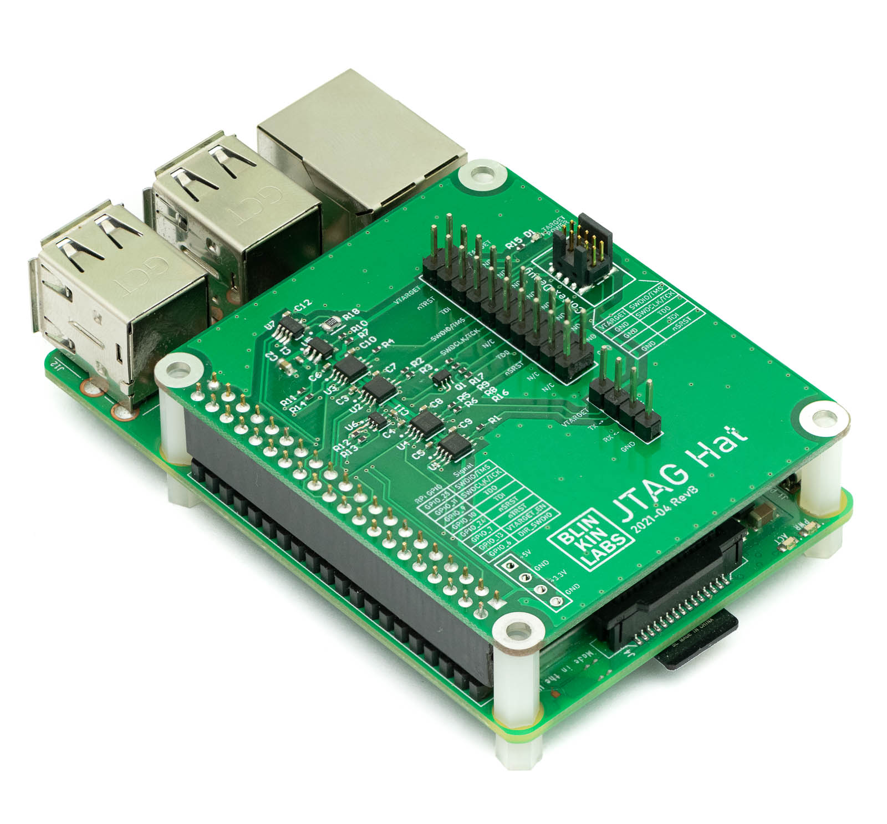
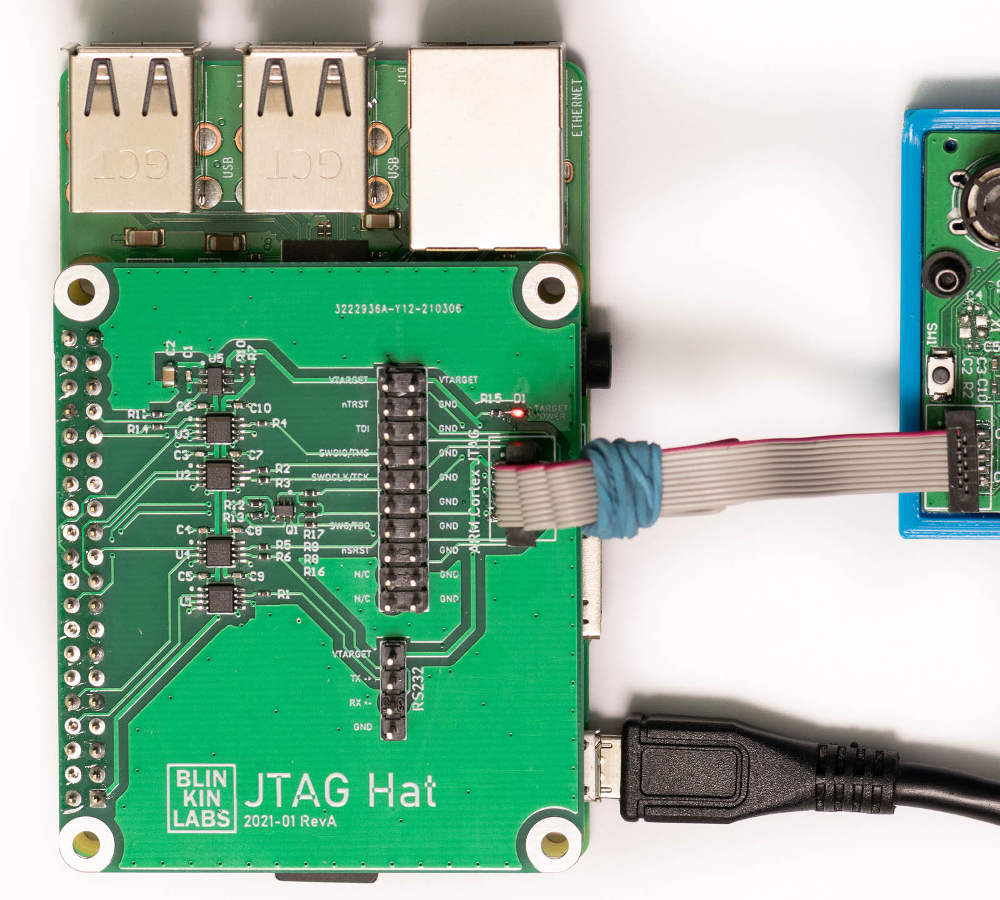
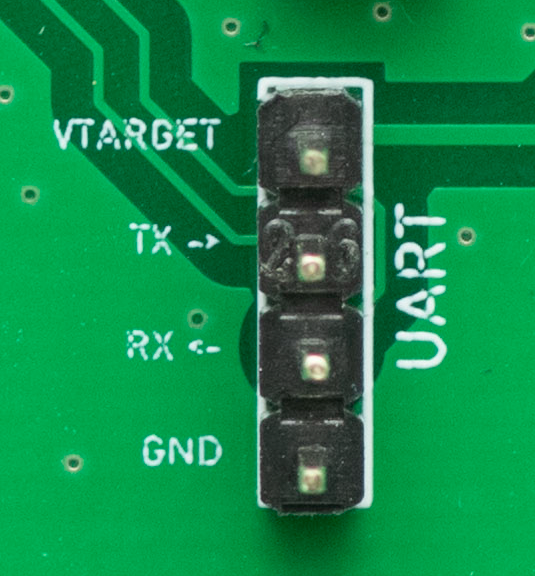
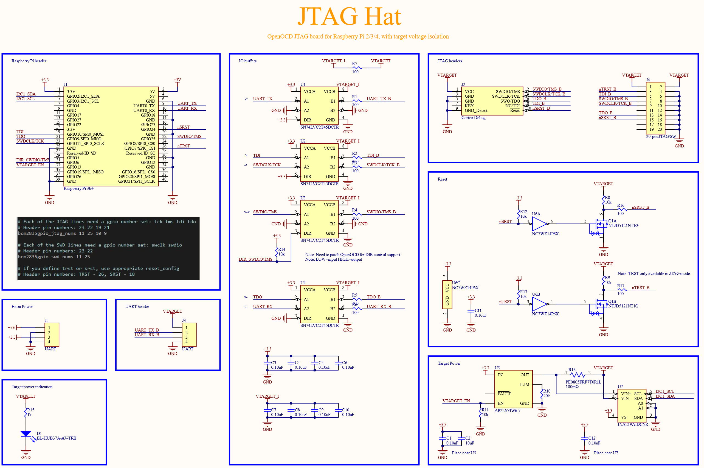

# JTAG Hat



Convert your Raspberry Pi 2/3/4 into a networked JTAG debugger!

The JTAG Hat is designed to work with [OpenOCD](http://openocd.org/), and provides a .05" 10-pin [Cortex Debug Connector](https://documentation-service.arm.com/static/5fce6c49e167456a35b36af1), with pins to support debugging devices with either a JTAG (TCK/TMS/TDI/TDO) or SWD (SWDIO/SWDCLK) programming interface. A traditional .1, 20-pin JTAG header is also provided, which can be used with 0.1" jumper wires for more flexibiity.

Features:
*    Level-shifted JTAG / SWD programming interface, supports 1.8V to 5V targets
*    Designed to work with OpenOCD, which supports debugging a large number of devices (STM32, ESP32, etc)
*    Selectable target power, to power your device from the RPi 3.3V suppy
*    Hardware reset (both SRST and TRST) via a pull-down transistor
*    Level-shifted UART interface connected to RPi serial port
*    Built-in voltage and current measurement of target device

[Get one here (US)](https://shop.blinkinlabs.com/collections/development-tools/products/jtag-hat) or [here (EU/rest of world)](https://shop-nl.blinkinlabs.com/collections/development-tools/products/jtag-hat), or make one yourself- all design files are in this repository.

## Setup

1. Use [Rasbperry Pi Imager](https://www.raspberrypi.org/software/) to image the micro SD card with 'Raspberry Pi OS Lite'

2. Before clicking 'write', enter the secret 'advanced options' menu by holding down Ctrl+Shift+X. Change the following settings:
   1. Set the hostname to 'jtaghat'
   2. Enable SSH, and set a password for the 'pi' user
   3. Enable WiFi, and set the SSID and password for your WiFi netowrk. Set the Wifi country to your country.
   4. Set the locale settings to your current location.
   5. Check the option to skip the first-run wizard.

2. Boot the pi, and check the router to determine the IP address, then SSH into it

3. Update packages and install git:
```
sudo apt update
sudo apt upgrade -y
sudo apt install -y git autoconf libtool libusb-1.0-0-dev screen telnet
```

4. Download and build the master branch of OpenOCD:
```
git clone https://git.code.sf.net/p/openocd/code openocd-code
cd openocd-code

./bootstrap
./configure --enable-sysfsgpio --enable-bcm2835gpio
make -j6
sudo make install
```

## Use it

1. Connect using the Arm Cortex Debug connector


This connector works well if your target board has one of these connectors. This connector supports both JTAG and SWD connection modes, and has a reset pin controlled by 'srst'. It's very tidy:



-or-

2.  Connect using the 20-pin 'legacy' connector


This connector works well if your target board has one of these connectors, or if you want to use jumper wires to connect to .1" headers on a board. This connector supports both JTAG and SWD connection modes, and has a reset pin controlled by 'srst', as well as one  controlled by 'trst'. Note that some of the optional signals (RTCK, DBGRQ, DBACK) are not supported by OpenOCD, and are not present on this connector.

For SWD mode, you'll need at least GND,SWDIO, and SWDCLK. For JTAG mode, you'll need GND,TCK,TDI,TDO, and TMS.

3. (optional) Enable target power

The JTAG Hat can provide an optional 3.3V, 500mA* supply to the target. To enable it, RPi GPIO13 should be set to an output:
```
echo 13 > /sys/class/gpio/export
echo out > /sys/class/gpio/gpio13/direction
echo 1 > /sys/class/gpio/gpio13/value
```

Similarly, to turn it off:
```
echo 0 > /sys/class/gpio/gpio13/value
```
Note: If your target board is already powered, do not enable target power! The red LED on the board will light up when the target power voltage is present.

4. Start an OpenOCD session for an STM32F0 target:
```
sudo openocd -f interface/jtag_hat_rpi2.cfg \
             -c "bindto 0.0.0.0; transport select swd" \
             -c "reset_config srst_only" \
             -c "adapter speed 1000" \
             -f target/stm32f0x.cfg
```

Now you can connect to the server using GDB, and flash new code, dump things, etc.

## Sensing load current

The hat includes an INA219 current sensor, which can be used to monitor the target power usage if powered through the Pi, and the target voltage if the target is self-powered. To use it:

1. Use 'sudo raspi-config', and under the 'Interfacing Options' menu, enable the I2C interface.

2. Install the [Pi INA219 library](https://github.com/chrisb2/pi_ina219/blob/master/README.md):
```
    sudo apt install python3-pip
    pip3 install pi-ina219
```

3. Create a new file called 'sense_current.py', and copy the following into it:

```
#!/usr/bin/env python3
from ina219 import INA219
from ina219 import DeviceRangeError
SHUNT_OHMS = 0.1
def read():
   ina = INA219(SHUNT_OHMS)
   ina.configure()
   print("Bus Voltage: {:.3f} V".format(ina.voltage()))
   try:
       print("Bus Current: {:.3f} mA".format(ina.current()))
       print("Power: {:.3f} mW".format(ina.power()))
       print("Shunt voltage: {:.3f} mV".format(ina.shunt_voltage()))
   except DeviceRangeError as e:
       # Current out of device range with specified shunt resister
       print(e)
if __name__ == "__main__":
   read()
```

4. Make the script executable, then run it:
```
chmod +x sense_current.py
./sense_current.py
    
Bus Voltage: 3.280 V
Bus Current: 95.000 mA
Power: 311.707 mW
Shunt voltage: 9.510 mV
```

Note that the current measurement includes the power used by the target voltage indicator LED, as well as the level translation buffers.

## UART header



The JTAG Hat also has a level-translated UART header. The UART situation on Raspberry Pi is a [little complicated](https://www.raspberrypi.org/documentation/configuration/uart.md), so a little configuration is needed to make this pin work.

### Setup

1. Disable Bluetooth (Raspberry Pi 3,4 only): On the Raspberry Pi 3 and 4, the UART is normally connected to the Bluetooth chip, so we'll first need to disable that to free up the pins. Add the following to /boot/config.txt:
```
dtoverlay=disable-bt
```
2. Enable the serial port and configure it for general purpose use. Run 'sudo raspi-config', then select '3 Interface Options', 'P6 Serial Port'. Choose 'No' to disable the login shell over serial, then 'Yes' to enable hardware serial. Choose 'Ok' to confirm the settings, then 'Finish' to apply them. Choose 'Yes' to reboot the system and apply the changes.

3. Once the system reboots, check that the serial port is configured correctly:
```
ls -l /dev/serial0
```
This should now point to ttyAM0:
```
lrwxrwxrwx 1 root root 7 Mar 24 15:10 /dev/serial0 -> ttyAMA0
```

### Using the serial port

Once the serial port is configured, it should be ready for use. You can test it using screen:
```
screen /dev/serial0 115200
```

Tip: Make sure to connect a ground wire between the JTAG Hat and the target board.

Tip: Make sure Vtarget is enabled, otherwise the serial port buffers won't work.

## Hardware design



This repository contains the Altium [source files](https://github.com/Blinkinlabs/JTAG_hat/tree/main/pcb), as well as the gerbers used for production.

## License

Copyright Blinkinlabs 2021. The board design is [licensed under CERN-OHL-P v2](https://cern.ch/cern-ohl) and documentation is released under [Attribution-ShareAlike 4.0 International](https://creativecommons.org/licenses/by-sa/4.0/legalcode)
